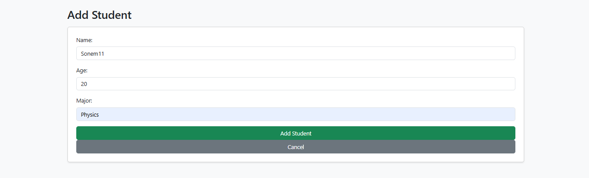
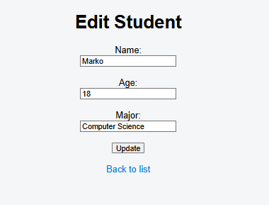
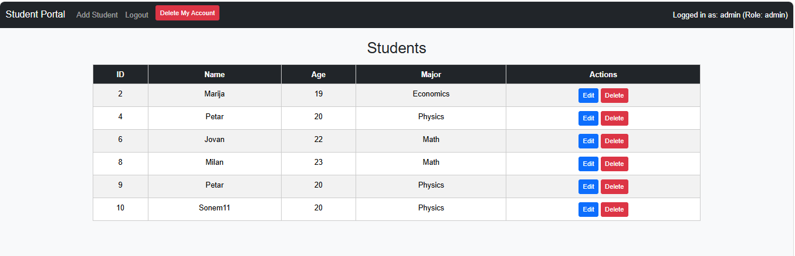
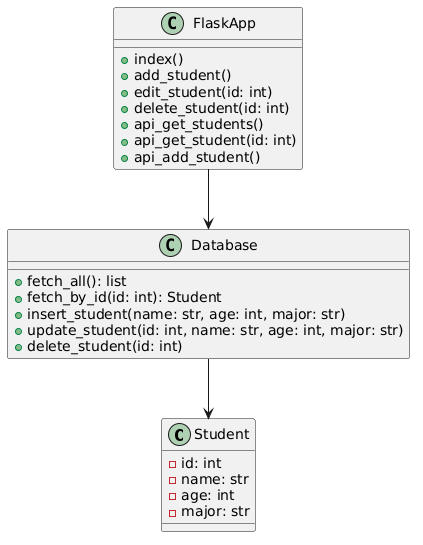

# Student Portal 🏫

## Overview
A simple web application demonstrating CRUD operations using Flask and SQLite.  
This project connects backend (Flask), database (SQLite), and frontend (HTML + CSS). Now extended with REST API endpoints for JSON access.

## Features
- Add new students via form (`add_student.html`)
- Edit existing students (`edit_student.html`)
- Delete students directly from the list
- View all students in a table (`index.html`)
- REST API for programmatic access
- UML diagram showing project structure

## Visual Representation
### Add Student Form


### Edit Student Form


### Student List


## Technologies Used
- Python 3.14
- Flask framework
- SQLite database
- HTML + CSS frontend

## Run the App
pip install flask
python app.py


Open in browser: [http://127.0.0.1:5000](http://127.0.0.1:5000)

## Example Output

### Student Portal

#### Add Student
By clicking on "Add Student," a form opens for entering a new student.

#### Student List
The table displays all students with options to edit or delete:

| ID | Name   | Age | Major            | Actions        |
|----|--------|-----|------------------|----------------|
| 1  | Marko  | 18  | Computer Science | Edit \| Delete |
| 2  | Marija | 19  | Economics        | Edit \| Delete |
| 3  | Petar  | 20  | Physics          | Edit \| Delete |

## REST API Endpoints

The Student Portal also provides a REST API for programmatic access to student data.  
All responses are returned in **JSON format**.

| Method | Endpoint              | Description                  | Example Response |
|--------|-----------------------|------------------------------|------------------|
| GET    | `/api/students`       | Get all students             | `[{"id":1,"name":"Marko","age":18,"major":"Computer Science"}, {"id":2,"name":"Marija","age":19,"major":"Economics"}]` |
| GET    | `/api/student/<id>`   | Get student by ID            | `{"id":1,"name":"Marko","age":18,"major":"Computer Science"}` |
| POST   | `/api/student`        | Add new student (JSON body)  | `{"message":"Student added successfully"}` |

### Example Usage

#### Get all students
```bash
curl http://127.0.0.1:5000/api/students
Get student by ID
curl http://127.0.0.1:5000/api/student/1
Add new student (Windows CMD)
curl -X POST http://127.0.0.1:5000/api/student -H "Content-Type: application/json" -d "{\"name\":\"Petar\",\"age\":20,\"major\":\"Physics\"}"

Response:
{"message": "Student added successfully"}


## UML Diagram

The following diagram illustrates the structure of the Student Portal:


